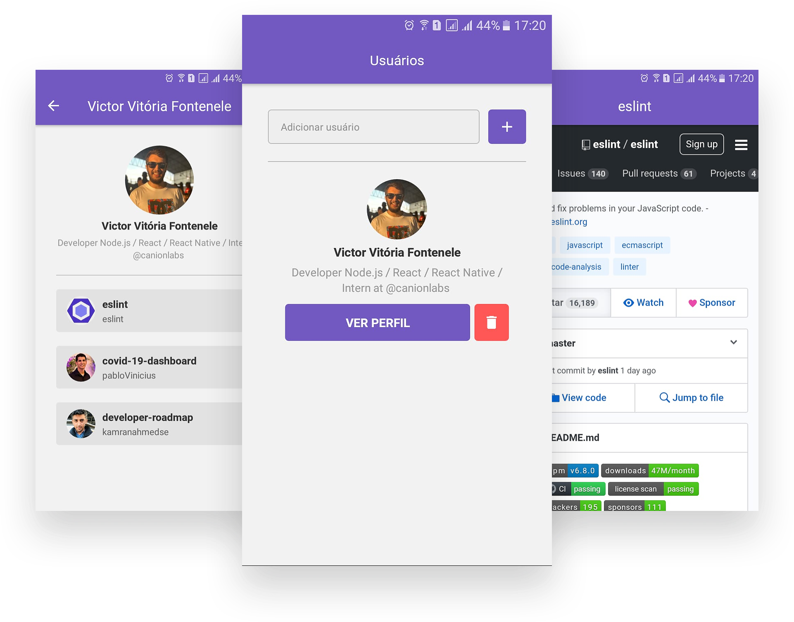

<h1 align="center">
    
</h1>

<blockquote align="center">“Your limitation—it's only your imagination.”</blockquote>

<p align="center">
  <a href="#bulb-about">About</a>&nbsp;&nbsp;&nbsp;|&nbsp;&nbsp;&nbsp;
  <a href="#computer-install">Install</a>&nbsp;&nbsp;&nbsp;|&nbsp;&nbsp;&nbsp;
  <a href="#boom-result">Result</a>&nbsp;&nbsp;&nbsp;|&nbsp;&nbsp;&nbsp;
  <a href="#memo-licença">License</a>
</p>

## :bulb: About

<p align="justify">React Native application to consume git API, where we see all stars it has, and when we click on the star, we see it in webview. Technologies used:</p>

- [React](https://reactjs.org/)

<p align="justify">for code pattern i used:</p>

- [Eslint](https://eslint.org/)
- [Prettier](https://prettier.io/)

<p align="justify">and to debug errors:</p>

- [Reactotron](https://infinite.red/reactotron)

## :computer: Install

**Clone**
```
git clone https://github.com/victorvf/first-react-native.git
```

**React Native** -> (I developed this application using my own cell phone(ANDROID), then the access settings are with my machine address, we will have to modify them.)

```
- src/config/ReactotronConfig.js -> .configure({ host: 'your host' })

- yarn install

- yarn android

- yarn start
```


## :boom: Result

<h3 align="center">
    
</h3>

## :memo: License

this project is under the MIT license. See the archive [LICENSE](https://github.com/Rocketseat/bootcamp-gostack-desafio-03/blob/master/LICENSE.md) for more details.
